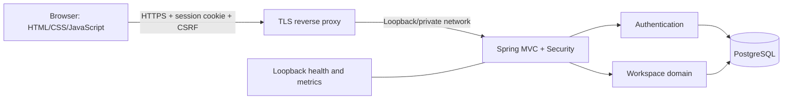
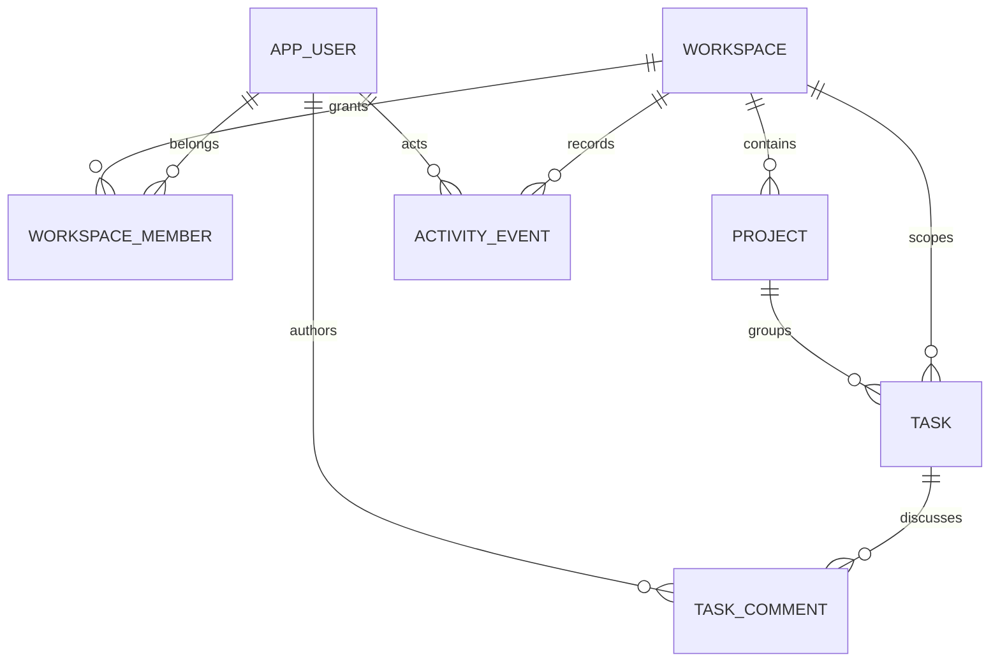

# Architecture

Orbit is a single deployable Spring Boot application with a static browser client and a relational database. It uses Java 17, Spring MVC, Spring Security, Spring JDBC, Spring Session JDBC, Jakarta Validation, Flyway, and Actuator. H2 provides a persistent local experience; PostgreSQL is the production database.

## Module boundaries

`com.orbit.auth` owns registration, BCrypt authentication, explicit session security-context persistence, session ID rotation, and current-user resolution. A user is global; membership grants access to individual workspaces.

`com.orbit.config` owns filter chains, CSRF, security headers, request IDs, error translation, and the bounded authentication rate limiter. Infrastructure does not authorize workspace resources: the domain checks membership and roles on each request.

`com.orbit.domain` owns workspace membership, projects, tasks, comments, activity, overview aggregation, and export. Controllers deserialize validated records and pass the authenticated user ID to the service. The service uses parameterized JDBC queries and explicit response records. Static assets use this same-origin API; there is no separate frontend deployment or CORS dependency.

## Data and invariants

All application IDs are UUID strings. Timestamps retain timezone information; deadlines are calendar dates. Membership uses a `(workspace_id, user_id)` primary key. Task references use composite workspace/project and workspace/assignee foreign keys, which reject references crossing workspaces even if an application guard fails. Comments similarly reference a task within the same workspace.

An OWNER manages membership. OWNER and MEMBER edit projects/tasks and add comments. VIEWER can read and export. Workspace creation grants OWNER to the creator. Owners cannot demote themselves or delete an owner membership. Removing a member clears their task assignments and increments those task versions before deleting membership. Existing comments and activity retain their author identity.

The domain checks resource IDs within the requested workspace and checks actor membership first. A nonexistent workspace or a workspace inaccessible to the actor returns 404. A member who lacks an action's role gets 403. The service never trusts a frontend role or supplied actor ID.

## Consistency and concurrent changes

Mutation methods are transactional. The main write and its activity insert either both commit or both roll back. The browser receives a task/project version. Updates use `WHERE workspace_id=? AND id=? AND version=?` and increment that version. Zero affected rows after a valid lookup produce 409. Task deletion also requires a version. A stale editor must reload and apply their change against the current object.

List endpoints return bounded pages: sizes 1–100, page numbers starting at zero. Task search uses escaped SQL LIKE patterns so `%` and `_` remain literal text. Sorts include IDs as a stable tie-breaker. This provides deterministic pages when data is unchanged; changes between page requests can move records, so this is not a snapshot or cursor pagination guarantee. Dashboard reads and CSV exports use current committed data. Exports and overview computation should be load-tested at the largest intended workspace size; there is no asynchronous export job.

## Sessions and request security

Authentication uses a server-managed session cookie and JDBC session rows. Login rotates the ID and clears the previous CSRF token; the client retrieves a new one. The cookie is HttpOnly, SameSite=Lax, and Secure in production. POST/PATCH/DELETE requests require the header obtained from `GET /api/auth/csrf`. No bearer token or password is retained in browser storage.

BCrypt cost 12 deliberately makes password checking expensive. The built-in limiter allows a bounded number of authentication requests per remote IP per minute and stores at most 10,000 active IP windows. Its state is not shared across instances, and a reverse proxy can collapse remote addresses. Configure distributed throttling at the trusted ingress with a considered identity/IP policy before public traffic.

The default CSP allows same-origin scripts, resources, and API connections; no CDN is required. It denies framing and object embedding. Inline styles remain allowed. Untrusted text is rendered as text or escaped when template markup is built. CSV values with dangerous formula prefixes are neutralized in addition to RFC 4180 quoting.

## Deployment and growth

The production profile requires database credentials and disables demo initialization. Flyway validates migrations and runs them during application startup. The JDBC pool has bounded connections; tune its size together with the number of replicas and PostgreSQL's connection limit. Database-backed sessions support several application replicas without sticky routing. Rolling upgrades still require compatible API and migration changes, and the per-instance rate limiter remains supplemental.

The management HTTP server binds to loopback on port 9091. Health details are hidden and metrics remain within that network boundary. The application has graceful shutdown; orchestration should stop sending traffic before ending its process. Compose is a single-host reference deployment with persistent PostgreSQL storage, not high availability or automated disaster recovery.

For a stricter environment, separate migration and runtime database privileges, use managed PostgreSQL with point-in-time recovery, pin container/action digests, add SSO/MFA and signup controls, define retention, and perform an independent security assessment. These are environment or product extensions, not features implied by the current code.
